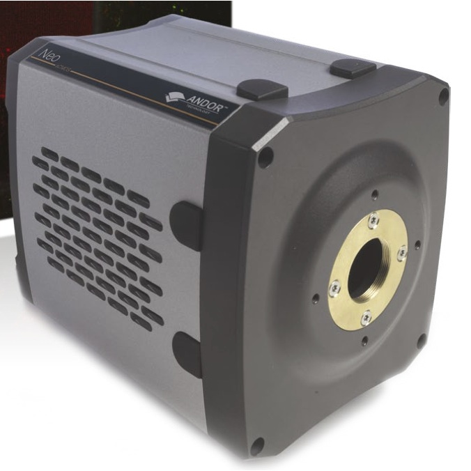

Andor3
-------



Intoduction
```````````
CAUTION : This documentation is currently very partial and needs some extra work to be completed !!!

Andor Technology manufactuer offers a large catalogue of scientific cameras. Covered scientific applications are low ligth imaging, spectroscopy, microscopy, time-resolved and high energy detection. 
Andor is providing a Software Development Tool (SDK) for both Windows and Linux, supporting different interface buses such as USB, CameraLink and also some specific acquisition PCI board. Unfortunately there was a significant API change between the v2 line of SDK and the brand new v3 of the SDK, and recent cameras are only supported by the v3 SDK, whilst this new SDK is not (yet ?) supporting previously built cameras.

The Lima module as been tested only with this cameras models:
  - Neo (3-tap Camera Link, Linux OS)

Module configuration
````````````````````
Previously to this you have to install the Andor SDK the default path (/usr/local).
For our test we used the SDK for Linux version **V3.3.30004.0** and ran the install script "install_andor"
for which option 2 (64b linux) was selected, the default installation is made under /usr/local/ with:

  - /usr/local/include, header files
  - /usr/local/lib, library files
  - /usr/local/andor/bitflow, files for the frame-grabber driver (including camera firmware/frame grabber configuration)

The Linux SDK 3.3 has shared libraries which has been compiled on recent linux kernel, check first you have the right kernel and
libc available by compiling one of the example program available under examples/console.
Andor3 python module needs at least the lima core module.

The best before using this Lima pluggin with a Andor Neo camera is to test the proper setting of the frame-grabber driver and system configuration by
using the two test programs included in the SDK. Those are typically found in /usr/local/andor/examples/ and are listdevices and image.

The minimum configuration file is *config.inc* :

.. code-block:: sh

  COMPILE_CORE=1
  COMPILE_SIMULATOR=0
  COMPILE_SPS_IMAGE=1
  COMPILE_ESPIA=0
  COMPILE_FRELON=0
  COMPILE_MAXIPIX=0
  COMPILE_PILATUS=0
  COMPILE_BASLER=0
  COMPILE_ANDOR=0
  COMPILE_ANDOR3=1
  COMPILE_CBF_SAVING=0
  export COMPILE_CORE COMPILE_SPS_IMAGE COMPILE_SIMULATOR \
         COMPILE_ESPIA COMPILE_FRELON COMPILE_MAXIPIX COMPILE_PILATUS \
         COMPILE_BASLER COMPILE_ANDOR COMPILE_ANDOR3 COMPILE_CBF_SAVING


See :ref:`Compilation`

Installation
`````````````

- After installing andor3 modules :ref:`installation`

- And probably Tango server :ref:`tango_installation`

Configuration
`````````````

- Still to be written.